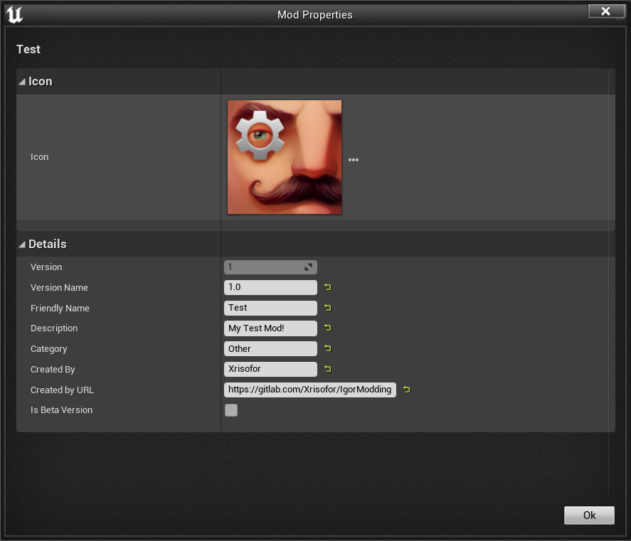

# IgorModding

> For Unreal Engine 4.27 and higher

The modification system was developed by Igor Belov or one of the tinyBuild programmers.

## Features

> This modding system replicates the core components and plugins from the Hello Neighbor mod kit, allowing you to create and run mods in the same way.

- **GameInstance** - with `ModKit` singleton accessible via `GetModKit()`.
- **UModKit** - core mod manager class for handling mods.
- **Hello Neighbor Mod Plugin** - base plugin for modding support.
- **ASosed** - simple base character class, used as foundation for mods.
- **ANeighborStart** - determines which Neighbor to spawn, allowing mod-controlled gameplay.

<div align="center">
    <br />
    GameInstance
</div>

## Unreal Engine 5 Specifics
When using UE5, the build architecture is more restrictive. To ensure the project compiles and mods load correctly, please note:

1. **No IO Store Support**: This modding system relies on the legacy .pak file format. The new IO Store system (.utoc / .ucas) introduced in UE5 for optimization is not supported. You must disable it in your Project Launcher profile when cooking both the base game and the mods.
2. **Platform Naming**: UE5 refers to the desktop platform simply as Windows, whereas UE4 used WindowsNoEditor.

## How to Compile the Game Correctly

To correctly build the game with the mod system, follow these steps in **Project Launcher**:

1. **Create a Custom Build Profile** - give it any name you like.
2. **Build** - choose any build type.
3. **Cook** - package the game for `WindowsNoEditor` (recommended) and `Android (ASTC)`.
4. In **Cook → Release / DLC / Patching Settings**:
   - Enable **Create a release version of the game for distribution**.
   - Set **Name of the new release to create** (recommended: `1.0`).
   - Make sure to update this version in the `HelloNeighborMod` plugin source code as well.
5. In **Cook → Advanced Settings**:
   - Only enable:
     - **Save packages without versions**
     - **Store all content in a single file (UnrealPak)**
   - All other options should be disabled, otherwise the built mods will not be visible in-game.
6. **Package** - configure as desired, but it is recommended to change only **Local Directory Path**, which defines where the final build will be saved.
7. **Archive** - disable.
8. **Deploy** - set to **Do not deploy**.

### Example Screenshots of Project Launcher Setup

|                Build & Cook                  |       Release / DLC / Patching Settings       |              Advanced Settings              |         Package, Archive & Deploy          |
|:--------------------------------------------:|:---------------------------------------------:|:-------------------------------------------:|:------------------------------------------:|
|  |  |  |  |

## The Hello Neighbor Mod Plugin

The plugin provides a comprehensive toolset for mod management, automated packaging, and Steam Workshop integration directly from the Unreal Editor toolbar.

### Key Features

- **Create Mod** - Opens a dedicated creation wizard.
    - Uses custom `IPluginWizardDefinition` with mod-specific templates (e.g., Empty Map, AI Setup, Test Field).
    - Automatically handles project file cleanup to ensure mods are correctly isolated.
    - Supports custom icons and metadata during the creation process.

- **Package Mod** - Automated multi-platform building system.
    - Supports **Windows (64-bit)**, **Linux**, and **Android (ASTC)**.
    - Uses UAT (Unreal Automation Tool) to create unversioned cooked content (DLC/Pak) based on a specific release version.
    - Automatically moves packaged files to a dedicated `Saved/ModPackage` folder for distribution.

- **Upload Mod (Steam Workshop)** – Integrated publication tool.
    - **One-Click Workflow**: If a mod isn't packaged yet, the plugin will "Build & Upload" automatically.
    - **Metadata Sync**: Syncs Friendly Name, Description, and Icon from the plugin descriptor to the Steam Workshop item.
    - **Persistent IDs**: Tracks Steam Workshop `PublishedFileId` via a `steam_id.txt` file inside the mod folder to handle updates seamlessly.
    - Real-time upload progress notifications and status updates in the editor.

- **Edit Mod Properties** - A custom detail view to modify `uplugin` metadata.
    - Change Friendly Name, Author, Version, and Category.
    - **Icon Customization**: Easily swap the mod's 128x128 icon through the interface.
    - Integrated with Source Control (Checkout) for descriptor updates.

- **Plugin Settings** - Located in **Project Settings → Plugins → Hello Neighbor Mod**.
    - Define the **Based On Release Version** to match your game's build version.
    - Customize the list of **Mod Templates** (paths and icons).
    - Configure **Supported Platforms** and build flavors (like Android ASTC).

### Steam Workshop Integration & Setup

The plugin features an automated Steam API lifecycle management system. To enable publication features, you must configure your `DefaultEngine.ini`:

```ini
[OnlineSubsystemSteam]
bEnabled=true
SteamDevAppId=480
```

**How it works:**
- **Automatic Initialization**: On startup, the plugin reads `SteamDevAppId` and automatically creates a `steam_appid.txt` file in the engine's executable directory (e.g., `Engine/Binaries/Win64/`). This initializes the Steam API for the editor session.
- **Dynamic UI**: If the `[OnlineSubsystemSteam]` section or `SteamDevAppId` is missing, the **"Upload Mod"** button and all related publication logic will be completely disabled.
- **Clean Exit**: Upon closing the editor, the plugin ensures the Steam API is shut down correctly and the environment remains clean for standard development.

|           Create Mod Window            |         Edit Mod Properties Window          |
|:--------------------------------------:|:-------------------------------------------:|
|  |  |