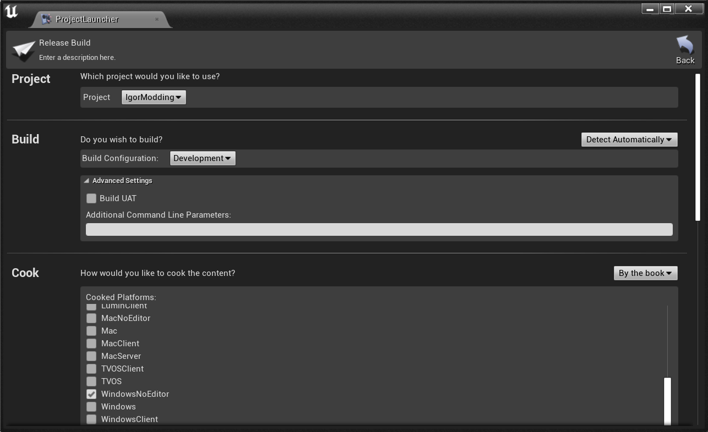
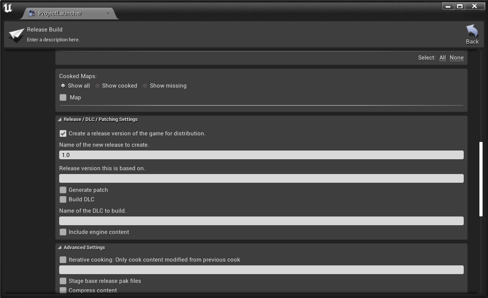
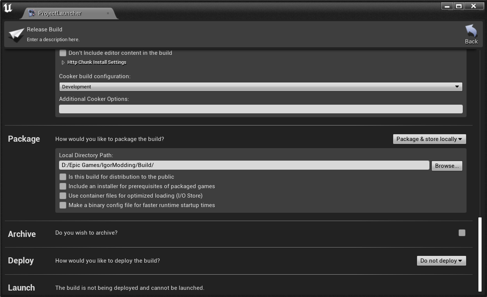

# IgorModding

> For Unreal Engine 4.27

The modification system was developed by Igor Belov or one of the tinyBuild programmers.

## How to Compile the Game Correctly

To correctly build the game with the mod system, follow these steps in **Project Launcher**:

1. **Create a Custom Build Profile** – give it any name you like.
2. **Build** – choose any build type.
3. **Cook** – package the game for `WindowsNoEditor` (recommended).
4. In **Cook → Release / DLC / Patching Settings**:
   - Enable **Create a release version of the game for distribution**.
   - Set **Name of the new release to create** (recommended: `1.0`).
   - Make sure to update this version in the `HelloNeighborMod` plugin source code as well.
5. In **Cook → Advanced Settings**:
   - Only enable:
     - **Save packages without versions**
     - **Store all content in a single file (UnrealPak)**
   - All other options should be disabled, otherwise the built mods will not be visible in-game.
6. **Package** – configure as desired, but it is recommended to change only **Local Directory Path**, which defines where the final build will be saved.
7. **Archive** – disable.
8. **Deploy** – set to **Do not deploy**.

### Example Screenshots of Project Launcher Setup

| Build & Cook | Release / DLC / Patching Settings | Advanced Settings | Package, Archive & Deploy |
|:-:|:-:|:-:|:-:|
|  |  |  |  |