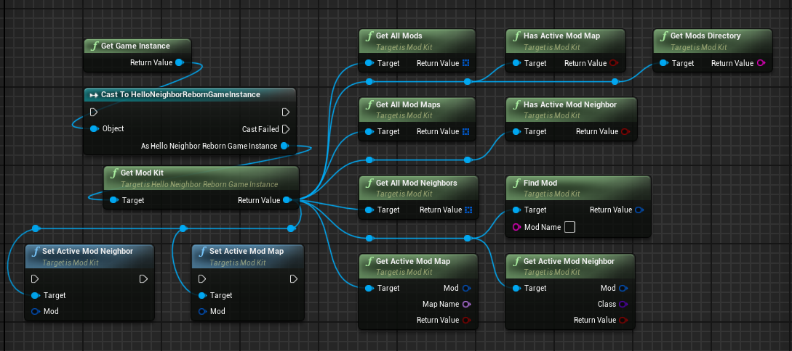
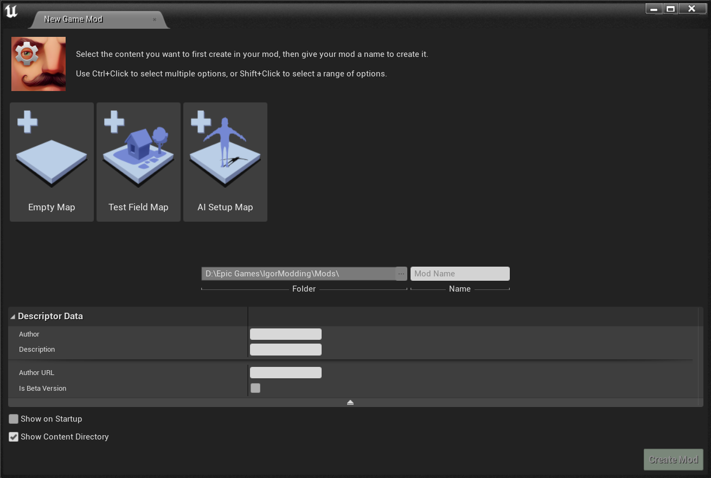

# IgorModding

> For Unreal Engine 4.27

The modification system was developed by Igor Belov or one of the tinyBuild programmers.

## Features

> This modding system replicates the core components and plugins from the Hello Neighbor mod kit, allowing you to create and run mods in the same way.

- **GameInstance** – with `ModKit` singleton accessible via `GetModKit()`.
- **UModKit** – core mod manager class for handling mods.
- **Hello Neighbor Mod Plugin** – base plugin for modding support.
- **ASosed** – simple base character class, used as foundation for mods.
- **ANeighborStart** – determines which Neighbor to spawn, allowing mod-controlled gameplay.

     
    GameInstance

## How to Compile the Game Correctly

To correctly build the game with the mod system, follow these steps in **Project Launcher**:

1. **Create a Custom Build Profile** - give it any name you like.
2. **Build** - choose any build type.
3. **Cook** - package the game for `WindowsNoEditor` (recommended).
4. In **Cook → Release / DLC / Patching Settings**:
   - Enable **Create a release version of the game for distribution**.
   - Set **Name of the new release to create** (recommended: `1.0`).
   - Make sure to update this version in the `HelloNeighborMod` plugin source code as well.
5. In **Cook → Advanced Settings**:
   - Only enable:
     - **Save packages without versions**
     - **Store all content in a single file (UnrealPak)**
   - All other options should be disabled, otherwise the built mods will not be visible in-game.
6. **Package** - configure as desired, but it is recommended to change only **Local Directory Path**, which defines where the final build will be saved.
7. **Archive** - disable.
8. **Deploy** - set to **Do not deploy**.

### Example Screenshots of Project Launcher Setup

| Build & Cook | Release / DLC / Patching Settings | Advanced Settings | Package, Archive & Deploy |
|:-:|:-:|:-:|:-:|
|  |  |  |  |

## Creating a Mod with Hello Neighbor Mod

The plugin adds two new buttons in the editor:

- **Create Mod** – opens a window for creating new mods.  
  - Uses a custom `IPluginWizardDefinition` with mod-specific settings and templates.  
  - Replicates the original Hello Neighbor Mod Kit workflow for creating mods.  

- **Package Mod** – a dropdown showing all available mods that can be packaged.  
  - Allows you to easily build and distribute your mods from within the editor.

     
    Create Mod window

